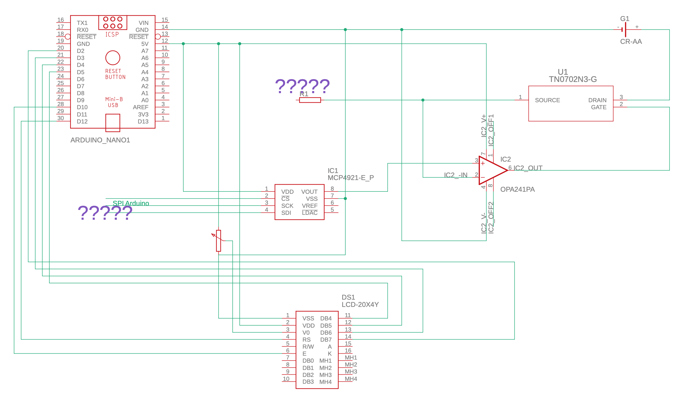
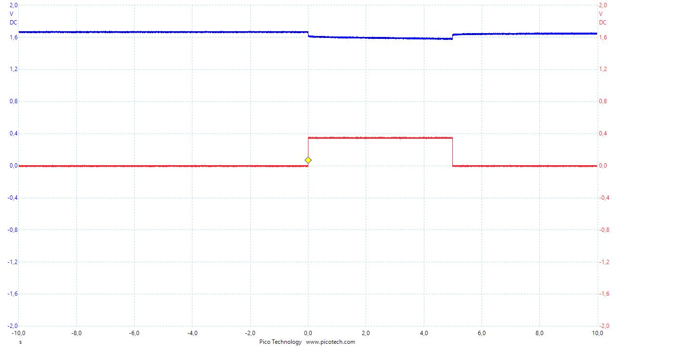
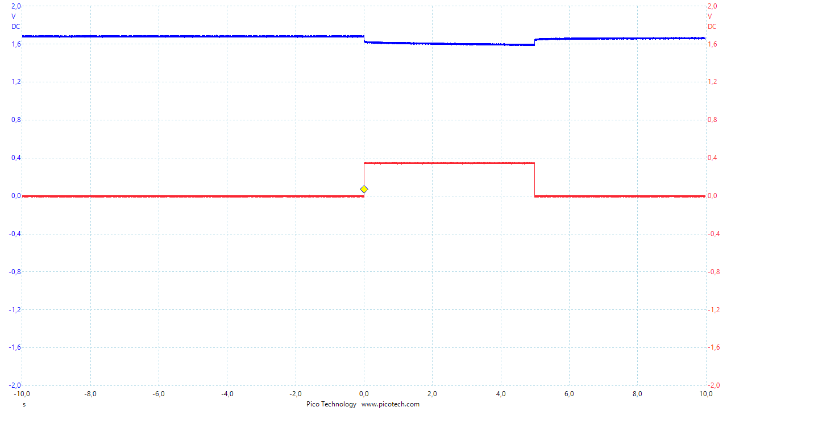

# Aufbau eines Batterietesters für Lithiumbatterien

## Aufgabenstellung
Es soll ein Prototyp eines Batterietester für Lithium-Primärzellen aufgebaut werden, der die verbleibende Kapazität einer Batterie durch Messung des Spannungabfalls an verschiedenen Testlasten approximiert. Dabei soll die Arduino-Plattform verwendet werden.

## Aufbau Code

## Platine
### Schaltplan

## Funktionsweise
Zur Realisierung wurden 2 Ansätze verfolgt:
   Variante 1:
   Die Kapazität soll mithilfe des Pulse Response ermittelt werden. Dazu soll ein 100mA-Impuls auf die Batterie gegeben werden. Je nach dem, wie lange die Batterie benötigt, um sich zu erholen (bis sich die Batteriespannung wieder stabilisiert hat), soll die Kapazität ermittelt werden.
   2. Die spannung soll an der Batterie gemessen werden, während sie mit 100mA belastet wird.

## Pulse Response 
Nach Analyse des Pulse Response mit einem Oszilloskop wurde festgestellt, das es keine wirkliche Pulse Response gibt. Die im Datenblatt angegebene Pulse Response scheint sich nur auf die Flanensteilheit und nicht auf die Kapazität zu beziehen:

## Messungen

#### 350mA_impuls_5s_100%

#### 350mA_impuls_5s_75%

#### 350mA_impuls_5s_50%

#### 350mA_impuls_5s_25%

| Prozent  | Gemessener Wert |
| -------: | --------------- |
| 100  | Content Cell  |
|  95  | Content Cell  |
|  90  | Content Cell  |
|  85  | Content Cell  |
|  80  | Content Cell  |
|  75  | Content Cell  |

## Test Markdown

{ width=50% }

