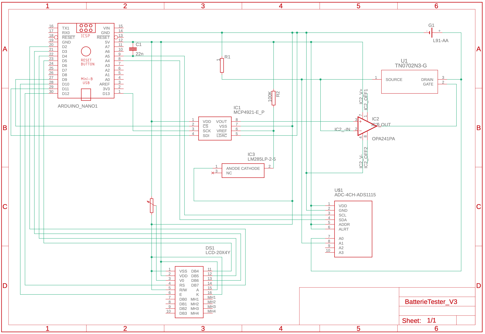
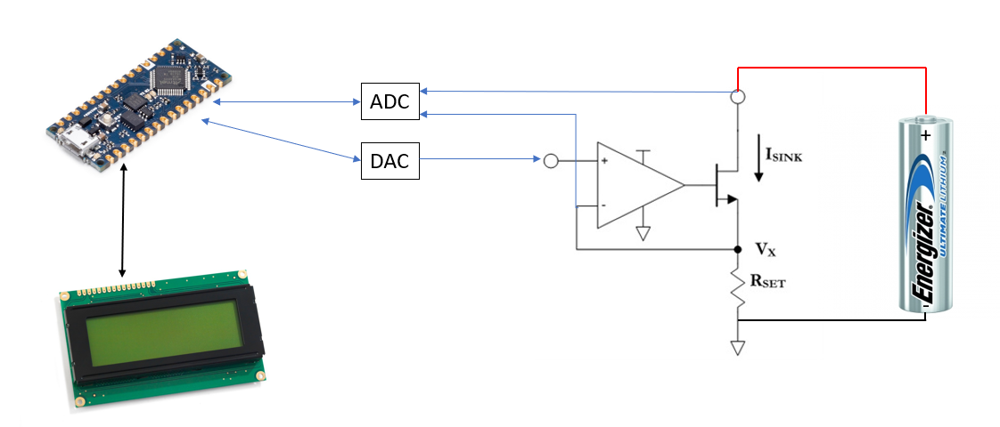

# Aufbau eines Batterietesters für Lithiumbatterien

- [Aufbau eines Batterietesters für Lithiumbatterien](#aufbau-eines-batterietesters-für-lithiumbatterien)
  - [Aufgabenstellung](#aufgabenstellung)
  - [Get started](#get-started)
  - [Code](#code)
  - [Platine](#platine)
    - [Bauteile](#bauteile)
    - [Schaltplan](#schaltplan)
      - [Schaltplan Version 3:](#schaltplan-version-3)
      - [Schematischer Aufbau:](#schematischer-aufbau)
  - [Funktionsweise](#funktionsweise)
  - [Messungen](#messungen)

[Link Markdown](https://github.com/FriendsOfREDAXO/markitup/blob/master/plugins/documentation/docs/de_de/howto_markdown.md)

---

## Aufgabenstellung
Es soll ein Prototyp eines Batterietester für Lithium-Primärzellen aufgebaut werden, der die verbleibende Kapazität einer Batterie durch Messung des Spannungabfalls an verschiedenen Testlasten approximiert. Dabei soll die Arduino-Plattform verwendet werden und [AA L91 ENERGIZER](https://data.energizer.com/PDFs/l91.pdf) gemessen werden.

## Get started

Es wird die Arduino IDE verwendet. Laden Sie sich den Code und die passenden Bibliotheken herunter. 

| Bauteil | Link                                                                      |
| ------- | ------------------------------------------------------------------------- |
| ADC     | [ADS1115](https://github.com/adafruit/Adafruit_ADS1X15)                   |
| DAC     | [MCP4921](https://github.com/michd/Arduino-MCP492X/blob/master/README.md) |

Die LCD Bibliothek finden Sie in dem Bibliothekverwalter unter "LiquidCrystal" von Adafruit.

Bibliotheken einbinden: [How to](https://42project.net/bibliothek-library-in-arduino-ide-installieren-und-einbinden/) 

Nachdem die Platine wie im Schaltplan zu sehen aufgebaut wurde, wird das Programm auf den Arduino gespielt.

## Code

Prinzipielle Vorgehensweise.
1. Last anlegen und Spannung einlesen
2. Spannung mitteln
3. Kapazität berechnen
4. Ausgabe LCD

Vorbereitungen:
- Wahl der Sprache: C++
- Wahl der Entwicklungsumgebung: Arduino IDE
- Dem Arduino externe Hardware bekannt machen und I/O Pins definieren

Messung:
Die Messung erfolgt in einer Dauerschleife bzw. Funktion loop(). Am DAC wird eine Last von 100mA bis 350mA eingestellt.
Im Anschluss wird die Spannung über dem ADC 20 mal eingelesen.
Spannung mitteln:
Die Gemessene Spannung wird in der Funktion SpannungMitteln() gemittelt.
Die Gemittelte Spannung wird dann im Schritt Kapazität berechnen weiterverwendet.
Kapazität berechnen:
Das Programm springt dazu in die Funktion KapazitaetBerechnen().
Die Spannung wird mit den Ermittelten Kapazitätswerten in einem Array abgeglichen.
Erst wird über eine Zählerschleife geguckt ab wann die Spannung kleiner wäre als
der nächste Wert im Array.
Dann werden die Werte zwischen denen die gemessene Spannung liegt nach der Geradengleichung verbunden.
Die Kapazität entspricht dann einem Wert auf dieser Geraden.
Ausgabe LCD:
In der Funktion Ausgabe() werden Schrittweise nacheinander alle Messwerte und Ergebnisse auf dem LCD ausgegeben.

## Platine
Da es sich um ein Prototypen handelt, wird die Schaltung auf einer Lochrasterplatine aufgebaut.

### Bauteile
| Lf Nr. | Bauteil         | Typ        | Beschreibung                                   |
| ------ | --------------- | ---------- | ---------------------------------------------- |
| 1      | Microcontroller | Arduino    | Arduino Nano Every                             |
| 2      | Display         | 20x4       | LCD 20x4 Display                               |
| 3      | OpAmp           | LMx58-N    | LMx58-N Low-Power, Dual-Operational Amplifiers |
| 4      | MOSFET          | TN0702N3-G | N-Channel 60-V (D-S) MOSFET                    |
| 5      | ADC             | ADS1115    | Analog-in-Digital-Wandler 16 Bit               |
| 6      | DAC             | MCP4921    | Digital-in-Analog-Wandler - DAC Sgl 12-bit SPI |
| 7      | Batteriehalter  | AA         | Batteriehalter für AA Batterien                |

### Schaltplan

**[Schaltplan Version 1](doc/circuit_diagram/SchaltplanV1.png)**

**[Schaltplan Version 2](doc/circuit_diagram/SchaltplanV2.png)**
- ADC wurde hinzugefügt

#### Schaltplan Version 3:

#### Schematischer Aufbau:

## Funktionsweise

Zur Realisierung wurden 2 Ansätze verfolgt:  
Variante 1:  
Die Kapazität soll mithilfe des Pulse Response ermittelt werden. Dazu soll ein 100mA-Impuls auf die Batterie gegeben werden. Je nach dem, wie lange die Batterie benötigt, um sich zu erholen (bis sich die Batteriespannung wieder stabilisiert hat), soll die Kapazität ermittelt werden.  
Variante 2:  
Die spannung soll an der Batterie gemessen werden, während sie mit 100mA belastet wird.

Die Batterie wird durch einen [Current Sink](https://e2e.ti.com/blogs_/b/powerhouse/archive/2015/08/21/how-to-generate-current-sources-and-sinks-of-arbitrary-magnitude) belastet, damit der Strom konstant gehalten werden kann.
Dadurch kann eine genauere Spannungskurve aufgezeichnet werden und die Restkapazität kann genauer ermittelt werden.

Da die Messungen bei Variante 1 nicht aussagekräftig ist, **wird die Variante 1 verwendet**.

## Messungen

Alle auf aufgezeichneten Daten und Graphen finden Sie [hier](doc/measurement.md).

