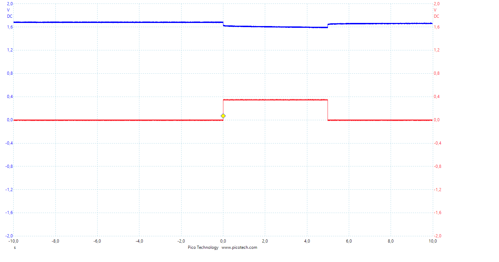

# Messungen

## Pulse Response

Nach Analyse des Pulse Response mit einem Oszilloskop wurde festgestellt, das es keine wirkliche Pulse Response gibt. Die im Datenblatt angegebene Pulse Response scheint sich nur auf die Flanensteilheit und nicht auf die Kapazität zu beziehen:

#### 350mA impuls=5s Kap.=100%

#### 350mA impuls=5s Kap.=75%

#### 350mA impuls=5s Kap.=50%

#### 350mA impuls=5s Kap.=25%

      
      <em>image_caption</em>

## Spannungsmessung

Spannungsmessung bei 350mA 

| Prozent [%] | Gemessener Wert [V] |
| -------: | --------------- |
|  100 | 1.507 |
|  95  | 1.575 |
|  90  | 1.570 |
|  85  | 1.564 |
|  80  | 1.557 |
|  75  | 1.549 |
|  70  | 1.542 |
|  65  | 1.536 |
|  60  | 1.528 |
|  55  | 1.520 |
|  50  | 1.512 |
|  45  | 1.503 |
|  40  | 1.493 |
|  35  | 1.482 |
|  30  | 1.471 |
|  25  | 1.458 |
|  20  | 1.443 |
|  15  | 1.425 |
|  10  | 1.398 |
|   5  | 1.255 |

### Spannungsverlauf @350mA

